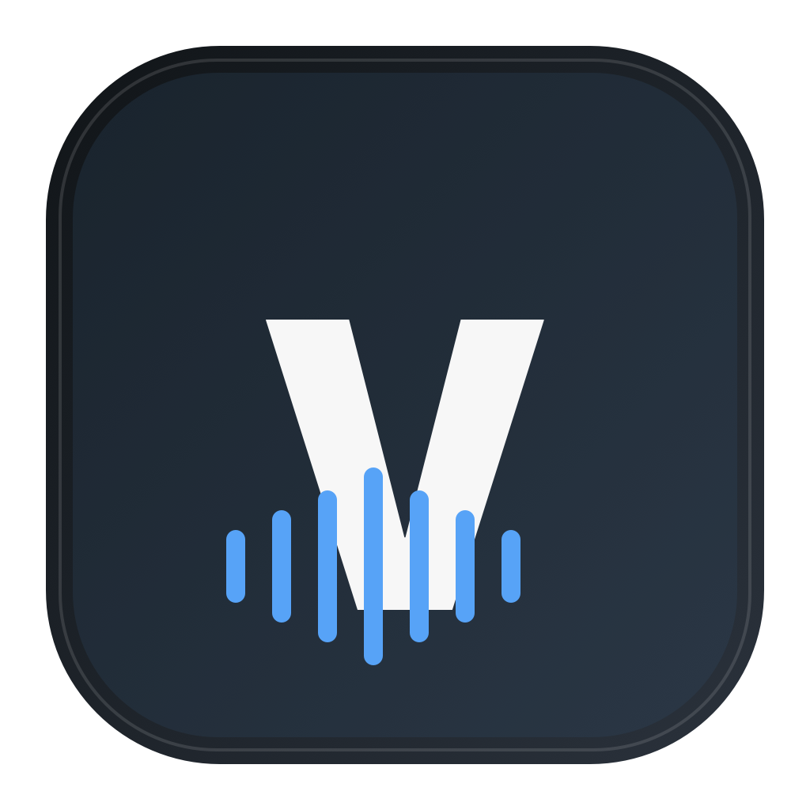

# Voice Bank

  

  Local-first, self-hosted voice input for macOS. 
  按右侧 Option 录音，在自己的 Mac 上完成转写并粘贴到光标处。

  <a href="README.zh-CN.md"><strong>中文说明</strong></a>
  ·
  <a href="README.en.md"><strong>English</strong></a>

  
  
  
  

## What It Does / 它能做什么

- Press the **right Option key** once to start recording and again to finish.
- Transcribe Chinese locally with FunASR; optionally polish longer text with a local Ollama model.
- Copy and paste the result into the current input position.
- Keep temporary audio and local text History under your control.

- 按一次**右侧 Option** 开始录音，再按一次结束。
- 使用本地 FunASR 转写中文；长文本可选用本地 Ollama 模型整理。
- 结果复制并粘贴到当前输入位置。
- 临时音频和本机文字 History 由你控制。

## Why Voice Bank / 为什么做它

这个语音输入法是在 Codex 5.5、5.6 的帮助下完成的。我完全不懂代码，Mac 自带的语音输入又不太好用。之前我用过一位大神做的语音输入法，开开心心用了几周，没想到它就下架了……于是我参照记忆中的使用体验，让 Codex 重新做了一个。感兴趣的话，可以把这个项目交给你自己的 AI，让它按照说明书协助安装。语音识别使用本地 FunASR 模型，文案优化也可以选装本地模型；我用的是很基础的 Gemma 4。主打一个能用。

Voice Bank was built with help from Codex 5.5 and 5.6. I do not know how to code, and the built-in Mac dictation did not work well for me. I previously used a voice input app made by a talented independent developer and happily relied on it for a few weeks, only to see it disappear. So, guided by my memory of that experience, I asked Codex to make another one. If you are interested, you can give this repository to your own AI assistant and ask it to help install the project by following the guide. Speech recognition runs on a local FunASR model, and text polishing can optionally use a local model too. I use a basic Gemma 4 setup. The goal is simple: it works.

## App and Source / 成品与源码

The macOS client is a self-contained native app. Releases can provide a PKG, DMG, and ZIP; the Python runtime is required only by the separate self-hosted transcription server. Public binaries must be Developer ID signed and notarized before release.

macOS 客户端已经是自包含的原生 App。Release 可以提供 PKG、DMG 和 ZIP；Python 只用于独立的自托管识别服务端。公开二进制在发布前必须完成 Developer ID 签名和 Apple 公证。完整说明见：

- [中文安装与使用教程](README.zh-CN.md)
- [English installation and user guide](README.en.md)
- [中文故障排查](docs/TROUBLESHOOTING.zh-CN.md)
- [English troubleshooting](docs/TROUBLESHOOTING.en.md)

## Privacy / 隐私

The server listens on `127.0.0.1` by default. Temporary recordings use private per-session directories and are deleted after processing. Client History, tokens, and settings stay in the user's account. No cloud API key is required.

服务默认只监听本机 `127.0.0.1`；临时录音使用独立私有目录并在处理后删除；客户端 History、令牌和设置保存在用户账户下；不需要云端 API Key。

See [SECURITY.md](SECURITY.md), [THIRD_PARTY_NOTICES.md](THIRD_PARTY_NOTICES.md), and [ASSETS.md](ASSETS.md) for security boundaries and licensing details.

## Contributing / 参与改进

Bug reports and small improvements are welcome. Before sharing logs, please remove recordings, transcripts, tokens, private addresses, and local file paths. See [CONTRIBUTING.md](CONTRIBUTING.md) for the short checklist.

欢迎反馈问题和提交小改进。分享日志前，请先删除录音、转写文字、令牌、私人地址和本机文件路径。简要流程见 [CONTRIBUTING.md](CONTRIBUTING.md)。

Project roles and AI-assisted development are documented in [CONTRIBUTORS.md](CONTRIBUTORS.md). / 项目角色与 AI 协作开发记录见 [CONTRIBUTORS.md](CONTRIBUTORS.md)。

## License

[MIT](LICENSE)
